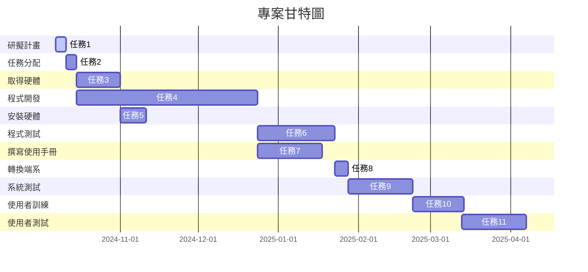

# PERT/CPM 圖

# 甘特圖

```mermaid
gantt
    title 專案甘特圖
    dateFormat  YYYY-MM-DD
    section 研擬計畫
    任務1: active, 2024-10-07, 4d
    
    section 任務分配
    任務2: 2024-10-11, 4d
    
    section 取得硬體
    任務3: 2024-10-15, 17d
    
    section 程式開發
    任務4: 2024-10-15, 70d
    
    section 安裝硬體
    任務5: 2024-11-01, 10d
    
    section 程式測試
    任務6: 2024-12-24, 30d
    
    section 撰寫使用手冊
    任務7: 2024-12-24, 25d
    
    section 轉換端系
    任務8: 2025-01-23, 5d
    
    section 系統測試
    任務9: 2025-01-28, 25d
    
    section 使用者訓練
    任務10: 2025-02-22, 20d
    
    section 使用者測試
    任務11: 2025-03-13, 25d

```

